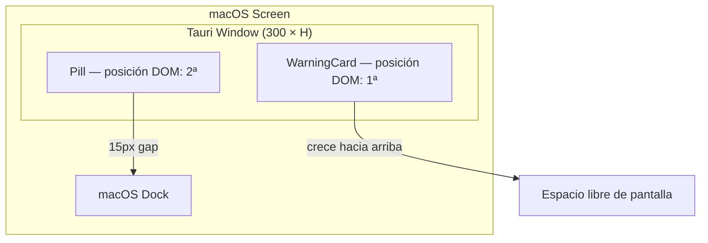
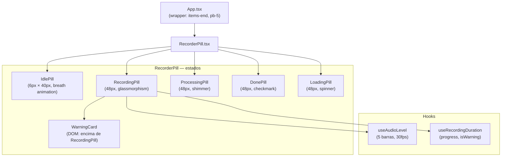
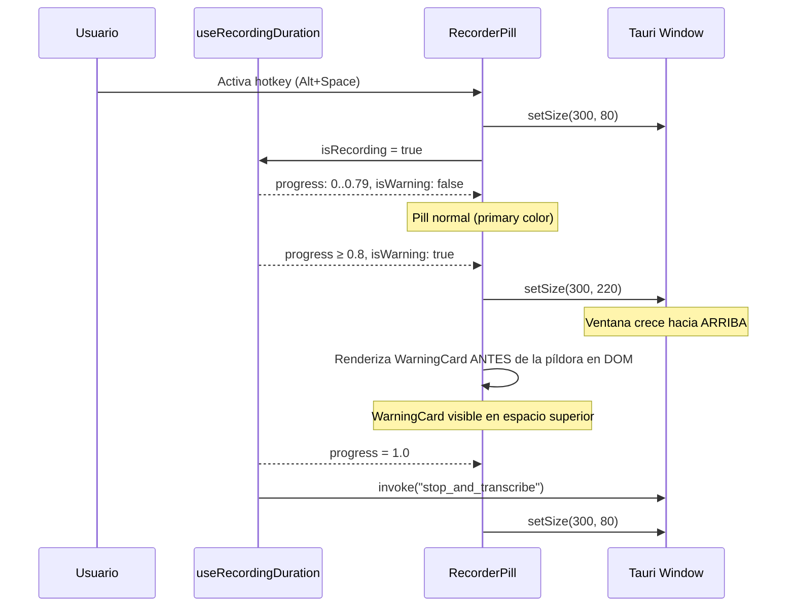
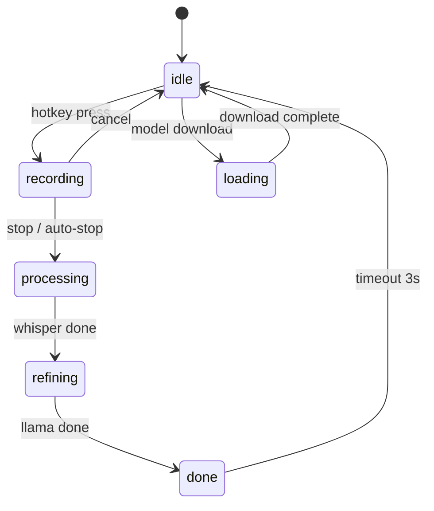

# Design Document: pill-ui-overhaul

## Overview

Rediseño visual completo de la píldora flotante de Voxa para cerrar la brecha entre el design spec ("Obsidian Glass", `docs/ui_spec_micro.md`) y la implementación actual. El trabajo abarca dos ejes: (1) corrección del bug de layout que impide que el popup de límite de grabación sea visible, y (2) elevación estética de todos los estados de la píldora al nivel "Wispr Flow" — glassmorphism real, animaciones fluidas, tipografía premium y transiciones de estado coherentes.

La ventana Tauri principal (`300×80px`) está anclada 15px sobre el Dock con `items-end` en el wrapper. Cuando la ventana crece con `setSize`, lo hace hacia **arriba** desde su posición fija — esto es correcto para el warning card, pero el DOM actual coloca el card **debajo** de la píldora en el flujo flex, quedando fuera del viewport. La solución es invertir el orden DOM: el card de warning va primero (arriba en el DOM = arriba en pantalla), la píldora va después (abajo en el DOM = anclada al fondo).

---

## Arquitectura de la Ventana Tauri



### Lógica de tamaño de ventana

| Estado | Altura ventana | Contenido visible |
|--------|---------------|-------------------|
| Normal (sin warning) | 80px | Solo píldora + padding |
| Warning activo | 220px | WarningCard (120px) + gap (8px) + píldora (48px) + padding (44px) |

La ventana crece hacia arriba porque está posicionada con `y` fijo cerca del Dock. El card de warning ocupa el espacio superior que se libera al crecer.

---

## Arquitectura de Componentes



---

## Diagramas de Secuencia — Flujos Principales

### Flujo de grabación con warning



### Transiciones de estado de la píldora



---

## Componentes e Interfaces

### RecorderPill — Props (sin cambios de API)

```typescript
interface RecorderPillProps {
  status: "idle" | "recording" | "processing" | "refining" | "loading" | "loading_whisper" | "loading_llama" | "done"
  label?: string          // override de texto para loading
  uiLocale: Locale
  appInfo?: AppInfo | null
}
```

### PillShell — Estilos base compartidos

```typescript
// Clase CSS base para todos los estados activos (recording, processing, done, loading)
const PILL_BASE = [
  "h-12",                          // 48px — spec: height 48px
  "rounded-[24px]",                // perfect pill — spec: corner-radius 24px
  "border border-white/10",        // spec: 1px solid rgba(255,255,255,0.1)
  "shadow-[0_20px_50px_rgba(0,0,0,0.5)]",  // spec: shadow
  "backdrop-blur-[40px]",          // spec: backdrop-filter blur 40px
  "flex items-center gap-3 px-4",
  "relative overflow-hidden",
  "transition-all duration-500",
].join(" ")

// Background obsidian glass
const PILL_BG = "bg-[#0A0A0A]/80"  // spec: #0A0A0A 80% opacity
```

### WarningCard — Interfaz visual

```typescript
interface WarningCardProps {
  timeRemaining: number   // segundos restantes
  uiLocale: Locale
}
// Dimensiones: w-[268px], altura ~100px
// Posición DOM: ANTES de la píldora en el flex-col
// Animación: fade-in + slide-in-from-bottom-2 (sube desde la píldora)
```

### useAudioLevel — Cambio de BAR_COUNT

```typescript
// ANTES: BAR_COUNT = 18 (demasiadas barras para 48px de altura)
// DESPUÉS: BAR_COUNT = 5 (spec: "5 vertical bars")
const BAR_COUNT = 5
const MIN_HEIGHT_PX = 4   // spec: variable heights 4px–16px
const MAX_HEIGHT_PX = 16  // spec: variable heights 4px–16px
```

---

## Modelos de Datos

### Estado de la ventana Tauri

```typescript
type WindowHeightState = {
  normal: 80    // px — estado base
  warning: 220  // px — pill(48) + gap(8) + card(100) + padding(64)
}

// Invariante: la ventana SIEMPRE tiene exactamente uno de estos dos tamaños
// cuando status === "recording". En cualquier otro estado, usa "normal".
```

### Tokens de diseño de la píldora (nuevos)

```typescript
const PILL_TOKENS = {
  height: 48,                          // px
  cornerRadius: 24,                    // px — perfect pill
  background: "rgba(10, 10, 10, 0.8)", // Deep Obsidian 80%
  backdropBlur: "40px",
  border: "1px solid rgba(255, 255, 255, 0.1)",
  shadow: "0 20px 50px rgba(0, 0, 0, 0.5)",
  typography: {
    size: "10px",
    weight: "700",
    tracking: "0.2em",
    transform: "uppercase",
  },
  waveform: {
    barCount: 5,
    minHeight: 4,   // px
    maxHeight: 16,  // px
    animDuration: "1.2s",
  },
  shimmer: {
    angle: "45deg",
    duration: "1.5s",
    timing: "linear",
    iteration: "infinite",
  },
} as const
```

---

## Especificación Visual por Estado

### Estado: idle

```
┌──────────────────────────────────────────────────────┐
│  Ventana: 300 × 80px                                 │
│                                                      │
│                                                      │
│              ████████████                            │
│              6px × 40px                              │
│              bg-primary/60                           │
│              breath animation (wave-pulse)           │
└──────────────────────────────────────────────────────┘
```

- Dimensiones: `h-[6px] w-[40px]` (sin cambio — ya es correcto)
- Color: `bg-primary/60` con animación `wave-pulse` (ya existe en App.css)
- `pointer-events-none` — clicks pasan al sistema

### Estado: recording (normal, progress < 0.8)

```
┌──────────────────────────────────────────────────────┐
│  Ventana: 300 × 80px                                 │
│                                                      │
│  ┌─────────────────────────────────────────────────┐ │
│  │ ✕  ▁▃▅▃▁  [app icon]  ■  ████████░░░░░░░░░░░░ │ │
│  │    waveform            stop  progress bar       │ │
│  └─────────────────────────────────────────────────┘ │
│  48px, obsidian glass, border white/10               │
└──────────────────────────────────────────────────────┘
```

- Background: `bg-[#0A0A0A]/80 backdrop-blur-[40px]`
- Border: `border border-white/10`
- Shadow: `shadow-[0_20px_50px_rgba(0,0,0,0.5)]`
- Progress bar: `h-[3px] bg-white/40` en `absolute bottom-0 left-0`
- Waveform: 5 barras, `bg-white`, heights 4–16px

### Estado: recording (warning, progress ≥ 0.8)

```
┌──────────────────────────────────────────────────────┐
│  Ventana: 300 × 220px                                │
│                                                      │
│  ┌─────────────────────────────────────────────────┐ │
│  │ ⚠  Límite de grabación                          │ │
│  │    Quedan {N}s. La grabación se enviará...      │ │
│  └─────────────────────────────────────────────────┘ │
│  (WarningCard — DOM primero, visible arriba)          │
│                                                      │
│  ┌─────────────────────────────────────────────────┐ │
│  │ ✕  ▁▃▅▃▁  [app icon]  ■  ████████████████████ │ │
│  └─────────────────────────────────────────────────┘ │
│  Píldora: bg-amber-600/80, progress bar amber        │
└──────────────────────────────────────────────────────┘
```

### Estado: processing / refining

```
┌──────────────────────────────────────────────────────┐
│  ┌─────────────────────────────────────────────────┐ │
│  │ ◌ spinner  PROCESANDO  ░░░░░░░░░░░░░░░░░░░░░░░ │ │
│  │            shimmer sweep →                      │ │
│  └─────────────────────────────────────────────────┘ │
│  bg-[#0A0A0A]/80, shimmer: white gradient 45°        │
└──────────────────────────────────────────────────────┘
```

- Shimmer: pseudo-elemento `::after` con `bg-gradient-to-r from-transparent via-white/15 to-transparent` en `animate-shimmer`
- Spinner: `border-t-white/80` en lugar de `border-t-white` (más sutil)

### Estado: done

```
┌──────────────────────────────────────────────────────┐
│  ┌─────────────────────────────────────────────────┐ │
│  │ ✓ check_circle  ENVIADO                         │ │
│  └─────────────────────────────────────────────────┘ │
│  bg-[#0A0A0A]/80, check icon: text-primary           │
└──────────────────────────────────────────────────────┘
```

- Icono: `text-primary` (violeta) en lugar de `text-white` — más premium
- Transición de salida: `animate-out fade-out zoom-out-95 duration-500`

---

## Algoritmos Clave con Especificaciones Formales

### Algoritmo: Gestión de tamaño de ventana

```pascal
PROCEDURE manageWindowSize(isWarning: boolean, prevIsWarning: boolean)
  INPUT: isWarning — estado actual del warning
         prevIsWarning — estado anterior (para evitar llamadas redundantes)
  OUTPUT: side-effect — Tauri window resize

  PRECONDITIONS:
    - getCurrentWindow() es accesible
    - PILL_WINDOW_HEIGHT_NORMAL = 80
    - PILL_WINDOW_HEIGHT_WARNING = 220

  POSTCONDITIONS:
    - Si isWarning = true: ventana.height = 220
    - Si isWarning = false: ventana.height = 80
    - Si isWarning = prevIsWarning: no se llama setSize (optimización)

  BEGIN
    IF isWarning = prevIsWarning THEN
      RETURN  // sin cambio — evitar resize innecesario
    END IF

    win ← getCurrentWindow()

    IF isWarning THEN
      win.setSize(new LogicalSize(300, PILL_WINDOW_HEIGHT_WARNING))
    ELSE
      win.setSize(new LogicalSize(300, PILL_WINDOW_HEIGHT_NORMAL))
    END IF
  END
```

**Invariante de layout:**
- El WarningCard SIEMPRE está en posición DOM anterior a la píldora
- El wrapper usa `flex-col-reverse` O el card está primero en el JSX con `flex-col`
- La ventana crece hacia arriba → el card ocupa el espacio superior

### Algoritmo: Renderizado de barras de forma de onda

```pascal
PROCEDURE computeWaveformBars(audioLevel: number, timeMs: number): number[5]
  INPUT: audioLevel — nivel EMA suavizado [0.0, 1.0]
         timeMs — timestamp actual en ms
  OUTPUT: array de 5 alturas en px [4, 16]

  PRECONDITIONS:
    - audioLevel ∈ [0.0, 1.0]
    - timeMs > 0
    - BAR_COUNT = 5
    - MIN_HEIGHT = 4, MAX_HEIGHT = 16

  POSTCONDITIONS:
    - ∀ h ∈ result: h ∈ [MIN_HEIGHT, MAX_HEIGHT]
    - result.length = 5
    - La barra central (índice 2) tiene mayor amplitud que las extremas

  BEGIN
    timeSec ← timeMs / 1000

    FOR i ← 0 TO 4 DO
      // Perfil de campana: centro = 1.0, extremos = 0.4
      dist ← |i - 2| / 2.0
      profile ← 0.4 + 0.6 * (1 - dist²)

      // Oscilación con fase y frecuencia por barra
      phase ← (i / 5) * 2π
      freq ← 1.8 + sin(i * 1.7) * 0.6
      oscillation ← sin(timeSec * freq * 2π + phase)

      // Amplitud combinada: idle + speech
      speechAmp ← audioLevel * profile * (MAX_HEIGHT - MIN_HEIGHT)
      amplitude ← 3 * profile + speechAmp * 0.6  // idle_amp=3 (visible pero sutil)

      baseline ← MIN_HEIGHT + speechAmp * 0.4
      h ← baseline + oscillation * amplitude

      result[i] ← clamp(h, MIN_HEIGHT, MAX_HEIGHT)
    END FOR

    RETURN result
  END
```

**Invariante de bucle:**
- En cada iteración i, `result[0..i-1]` contiene alturas válidas en `[MIN_HEIGHT, MAX_HEIGHT]`
- El estado de `smoothedRef` no se modifica dentro del bucle

### Algoritmo: Transición de estado de la píldora

```pascal
PROCEDURE getPillStyles(status: PillStatus, isWarning: boolean): StyleConfig
  INPUT: status — estado actual del pipeline
         isWarning — si el progreso ≥ 80%
  OUTPUT: StyleConfig con clases CSS y propiedades de animación

  PRECONDITIONS:
    - status ∈ {idle, recording, processing, refining, loading, done}
    - isWarning solo es relevante cuando status = "recording"

  POSTCONDITIONS:
    - Si status = "idle": resultado.height = "6px", resultado.pointerEvents = "none"
    - Si status ∈ {recording, processing, refining, done, loading}:
        resultado.height = "48px"
        resultado.background incluye "rgba(10,10,10,0.8)"
        resultado.backdropBlur = "40px"
    - Si status = "recording" ∧ isWarning:
        resultado.background incluye "amber-600"

  BEGIN
    MATCH status WITH
      CASE "idle":
        RETURN { height: "6px", width: "40px", bg: "bg-primary/60",
                 animation: "animate-wave", pointerEvents: "none" }

      CASE "recording":
        bg ← IF isWarning THEN "bg-amber-600/80" ELSE "bg-[#0A0A0A]/80"
        RETURN { height: "48px", bg: bg,
                 border: "border-white/10", blur: "backdrop-blur-[40px]",
                 shadow: "shadow-[0_20px_50px_rgba(0,0,0,0.5)]" }

      CASE "processing" | "refining":
        RETURN { height: "48px", bg: "bg-[#0A0A0A]/80",
                 shimmer: true, border: "border-white/10",
                 blur: "backdrop-blur-[40px]" }

      CASE "done":
        RETURN { height: "48px", bg: "bg-[#0A0A0A]/80",
                 icon: "check_circle", iconColor: "text-primary",
                 border: "border-white/10", blur: "backdrop-blur-[40px]" }

      CASE "loading" | "loading_whisper" | "loading_llama":
        RETURN { height: "48px", bg: "bg-[#0A0A0A]/80",
                 spinner: true, border: "border-white/10",
                 blur: "backdrop-blur-[40px]" }
    END MATCH
  END
```

---

## Especificación de Animaciones CSS

### Nuevas keyframes requeridas en App.css

```css
/* Shimmer premium para processing — 45° sweep */
@keyframes shimmer-sweep {
  0%   { transform: translateX(-150%) skewX(-15deg); }
  100% { transform: translateX(250%) skewX(-15deg); }
}

.animate-shimmer-sweep {
  animation: shimmer-sweep 1.5s linear infinite;
}

/* Breath para idle pill — sutil, no intrusivo */
@keyframes pill-breath {
  0%, 100% { opacity: 0.5; transform: scaleX(1); }
  50%       { opacity: 0.7; transform: scaleX(1.05); }
}

.animate-pill-breath {
  animation: pill-breath 3s ease-in-out infinite;
}

/* Bar grow para waveform — 5 barras con delay escalonado */
@keyframes bar-grow {
  0%, 100% { transform: scaleY(0.4); }
  50%       { transform: scaleY(1.0); }
}

/* Fade-out suave para transición de salida */
@keyframes pill-exit {
  0%   { opacity: 1; transform: scale(1) translateY(0); }
  100% { opacity: 0; transform: scale(0.9) translateY(4px); }
}
```

### Tokens de animación por estado

| Estado | Entrada | Salida | Duración |
|--------|---------|--------|----------|
| idle | `fade-in zoom-in-95` | `fade-out zoom-out-95` | 400ms |
| recording | `fade-in slide-in-from-bottom-1` | `fade-out slide-out-to-bottom-1` | 300ms |
| processing | `fade-in` | `fade-out` | 200ms |
| done | `fade-in zoom-in-95` | `fade-out zoom-out-95 delay-2500` | 300ms |
| warning card | `fade-in slide-in-from-bottom-2` | `fade-out slide-out-to-bottom-2` | 300ms |

---

## Manejo de Errores

### Escenario 1: setSize falla (Tauri window no disponible)

**Condición**: `getCurrentWindow().setSize()` lanza excepción  
**Respuesta**: Capturar con `.catch(() => {})` — la píldora sigue funcionando sin el resize  
**Recuperación**: El warning card puede quedar parcialmente oculto, pero la grabación continúa

### Escenario 2: useAudioLevel no recibe eventos

**Condición**: El backend no emite `audio-level` events  
**Respuesta**: Las barras muestran la animación idle (oscilación mínima con `IDLE_AMPLITUDE`)  
**Recuperación**: Automática — el hook usa `smoothedRef.current = 0` como fallback

### Escenario 3: Transición de estado abrupta

**Condición**: `status` cambia de `recording` a `processing` antes de que termine la animación de salida  
**Respuesta**: React reemplaza el componente — la animación de entrada del nuevo estado cubre la salida  
**Recuperación**: Usar `key` prop en el wrapper para forzar remount limpio en cada cambio de estado

---

## Estrategia de Testing

### Unit Testing

- `useRecordingDuration`: verificar que `isWarning` se activa exactamente en `progress >= 0.8`
- `useAudioLevel` (refactorizado a 5 barras): verificar que todas las alturas están en `[4, 16]`
- `getPillStyles`: verificar que cada estado retorna las clases correctas

### Property-Based Testing

**Librería**: `fast-check` (ya disponible en el ecosistema Vite/React)

**Propiedad 1 — Alturas de barras siempre en rango:**
```typescript
// Para cualquier audioLevel ∈ [0, 1] y timeMs > 0,
// todas las alturas de barras deben estar en [MIN_HEIGHT, MAX_HEIGHT]
fc.property(
  fc.float({ min: 0, max: 1 }),
  fc.integer({ min: 1, max: 1_000_000 }),
  (level, timeMs) => {
    const heights = computeBarHeights(level, timeMs)
    return heights.every(h => h >= 4 && h <= 16) && heights.length === 5
  }
)
```

**Propiedad 2 — Window height es determinista:**
```typescript
// Para cualquier isWarning, el tamaño de ventana es siempre uno de dos valores
fc.property(
  fc.boolean(),
  (isWarning) => {
    const height = isWarning ? 220 : 80
    return height === 80 || height === 220
  }
)
```

**Propiedad 3 — Progress siempre en [0, 1]:**
```typescript
// Para cualquier elapsed y maxSeconds > 0,
// progress = clamp(elapsed / maxSeconds, 0, 1) ∈ [0, 1]
fc.property(
  fc.float({ min: 0, max: 1000 }),
  fc.float({ min: 1, max: 360 }),
  (elapsed, maxSeconds) => {
    const p = Math.min(elapsed / maxSeconds, 1.0)
    return p >= 0 && p <= 1
  }
)
```

### Integration Testing

- Verificar que al activar `isWarning`, la ventana Tauri recibe `setSize(300, 220)` exactamente una vez
- Verificar que el WarningCard es visible en el viewport cuando `isWarning = true`
- Verificar que al cancelar la grabación, la ventana vuelve a `setSize(300, 80)`

---

## Consideraciones de Performance

- **setInterval a 33ms (~30fps)**: suficiente para animaciones de waveform; no usar `requestAnimationFrame` (throttled en ventanas Tauri accessory-mode)
- **5 barras vs 18**: reducción del 72% en elementos DOM animados — mejora perceptible en CPU
- **`transition: height 40ms ease-out`** en barras: suaviza el polling sin introducir lag visual
- **`backdrop-filter: blur(40px)`**: costoso en GPU; aplicar solo al elemento píldora, no al wrapper
- **`will-change: transform`** en el shimmer pseudo-elemento para activar compositing layer

## Consideraciones de Seguridad

No aplican consideraciones de seguridad específicas para este feature de UI. Los datos de audio son procesados localmente (on-device) y no se transmiten al renderizar la píldora.

---

## Dependencias

- `@tauri-apps/api/window` — `getCurrentWindow`, `LogicalSize` (ya importado)
- `@tauri-apps/api/core` — `invoke` (ya importado)
- Tailwind CSS v4 — clases arbitrarias `bg-[#0A0A0A]/80`, `backdrop-blur-[40px]`
- `fast-check` — para property-based tests (instalar si no está presente)
- Fuentes: Inter (ya cargada), Manrope (ya cargada)
- Material Symbols Outlined (ya cargado) — iconos `warning`, `check_circle`, `close`, `stop`

---

## Análisis de Brecha: Spec vs. Implementación Actual

| Aspecto | Spec (`ui_spec_micro.md`) | Implementación actual | Delta |
|---------|--------------------------|----------------------|-------|
| Altura píldora | 48px | 28px (`h-7`) | **−20px** |
| Corner radius | 24px | 40px (`rounded-voxa = 2.5rem`) | **+16px** (demasiado para 28px) |
| Background | `#0A0A0A` 80% opacity | `bg-primary` (violeta sólido) | **Color incorrecto** |
| Backdrop blur | 40px | No aplicado | **Falta** |
| Border | `rgba(255,255,255,0.1)` | No aplicado | **Falta** |
| Shadow | `0 20px 50px rgba(0,0,0,0.5)` | `shadow-2xl` (diferente) | **Incorrecto** |
| Barras waveform | 5 barras, 4–16px | 18 barras, 2–20px | **Exceso** |
| Shimmer processing | 45° sweep, 1.5s | `bg-white/10 animate-pulse` | **Incorrecto** |
| Warning card layout | Arriba de la píldora | Abajo (fuera de viewport) | **Bug crítico** |
| Altura ventana warning | 220px | 220px (correcto) | ✓ |
| Idle pill | 6px × 40px | 6px × 40px | ✓ |
| Typography | Inter Bold, 10px, 0.2em | Inter Bold, 10px, tracking-voxa-label | ~OK |
