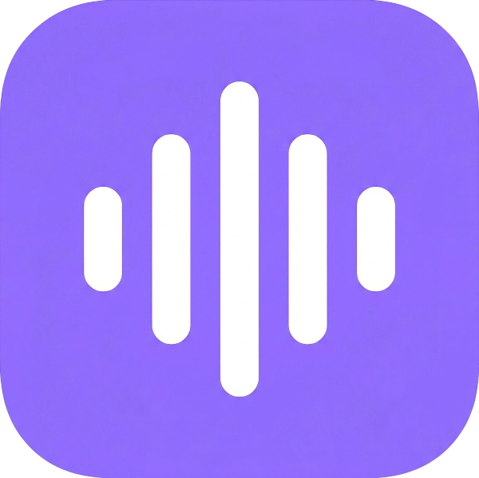

# Voxa

<div align="center">
  
  
  <p align="center">
    <strong>The Silent Conductor of Your Digital Workflow.</strong><br />
    <em>An ultra-minimalist, privacy-first, system-wide dictation tool.</em>
  </p>

  <p align="center">
    
    
    
  </p>
</div>

---

## 💎 Philosophy

Voxa isn't just another dictation app. It's a **High-Density, Minimalist Interface** designed following the **"Silent Conductor"** philosophy. It lives at the edge of your screen, ready to translate your thoughts into text directly into any application, without the friction of traditional UI.

Inspired by premium tools like *Wispr Flow*, Voxa focuses on speed, local-first intelligence, and an interface that feels like a piece of digital jewelry.

## ✨ Features

- **Ultra-Compact Pill**: A floating, Obsidian Glass interface that stays 15px from your Dock, providing visual feedback without stealing focus.
- **VAD-Reactive Animation**: The recording pill bars respond in real time to your microphone's RMS level — silence dampens, speech drives the wave.
- **System-Wide Injection**: Works in every app. Just talk, and let Voxa handle the `Cmd+V`.
- **Local Intelligence**: Powered by `whisper-rs` (transcription) and `llama-server` (post-processing via `llama.cpp`) — your voice never leaves your machine.
- **Focus Preservation**: Uses `NSWorkspace` + PID-based `activateWithOptions` to return focus to the exact app you were typing in, even Electron/JVM targets.
- **Transcript Editing**: Correct any transcription after the fact; Voxa extracts new words automatically to improve future recognition.
- **Obsidian Tray Menu**: A custom, high-blur glassmorphism menu for quick profile and language switching.
- **Flicker-Free Experience**: Precision window management handled by the Rust backend for instantaneous positioning.

## 🛠 Tech Stack

- **Core**: [Tauri v2](https://tauri.app/) (Rust)
- **Frontend**: [React](https://reactjs.org/) + [TypeScript](https://www.typescriptlang.org/) + [Vite](https://vitejs.dev/)
- **Styling**: Vanilla CSS (High-Performance Glassmorphism)
- **Engines**: 
  - `whisper-rs` (Local STT via `whisper.cpp`)
  - `llama-server` HTTP API (Intelligent Post-processing via `llama.cpp`)

## 📦 Download

**[→ Download Voxa v1.0.0 for macOS (Apple Silicon)](https://github.com/lufermalgo/voxa/releases/tag/v1.0.0)**

> Requires macOS 13+ on Apple Silicon (M1/M2/M3/M4). Intel support coming soon.

### First-time setup

1. Download and open the `.dmg` file.
2. Drag **Voxa** to your Applications folder.
3. On first launch, macOS will ask for **microphone** and **accessibility** permissions — both are required.
4. Voxa will automatically download the AI models (~1 GB) on first run.
5. Set your activation shortcut in **Settings** and start dictating.

> **Note:** Voxa runs entirely on-device. No data ever leaves your machine.

## 🚀 Development

### Prerequisites

- [Node.js](https://nodejs.org/) (v18+)
- [Rust](https://www.rust-lang.org/)
- [Tauri CLI](https://tauri.app/v1/guides/getting-started/prerequisites)
- `brew install llama.cpp` (for LLM inference)

### Running locally

1. Clone the repository:
   ```bash
   git clone https://github.com/lufermalgo/voxa.git
   cd voxa
   ```

2. Install dependencies:
   ```bash
   npm install
   ```

3. Run in development:
   ```bash
   npm run tauri dev
   ```

## 🏗 Architecture

Voxa uses a decoupled **MPSC (Multi-Producer Single-Consumer)** architecture to bridge the asynchronous audio recording stream with the transcription engine, ensuring the UI remains responsive even during heavy inference tasks.

## 📚 Technical Documentation

For deep dives into specific technical implementations, see:
- [macOS Native Event Tap & Shortcut Architecture](docs/architecture/shortcuts-native-tap.md)
- [VAD-Reactive Animation Architecture](docs/architecture/vad-animation.md)

---

<div align="center">
  <sub>Built with ❤️ by <a href="https://github.com/lufermalgo">lufermalgo</a></sub>
</div>
