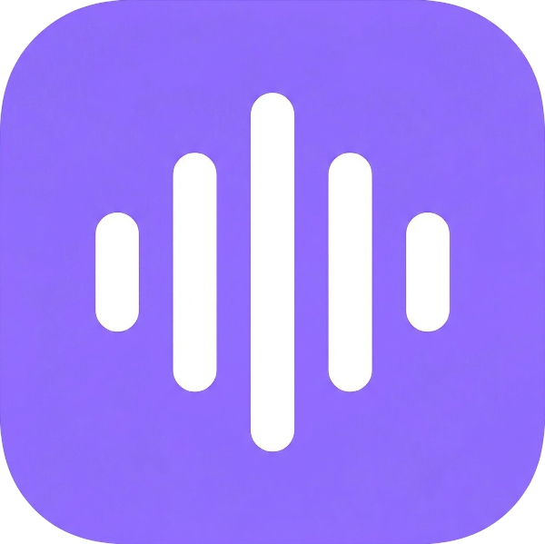

# Voxa — Local AI Dictation for macOS

<div align="center">
  

  <p align="center">
    <strong>Dictate into any app. Transform with local AI. No cloud. No subscription. Free forever.</strong>
  </p>

  <p align="center">
    <a href="https://github.com/lufermalgo/voxa/releases/tag/v1.6.0">
      
    </a>
    
    
    
    
    
  </p>
</div>

---

**Voxa** is a free, open-source macOS dictation app that transcribes your voice and injects text into any application — then transforms it with a **local LLM using customizable profiles**. Powered by [Whisper](https://github.com/ggerganov/whisper.cpp) for speech-to-text and [llama.cpp](https://github.com/ggerganov/llama.cpp) for intelligent post-processing, everything runs entirely on your machine.

> No API keys. No subscriptions. No data leaves your device. Ever.

---

## Why Voxa over Superwhisper / Wispr Flow / VoiceInk?

| | **Voxa** | Wispr Flow | Superwhisper | VoiceInk |
|---|:---:|:---:|:---:|:---:|
| Price | ✅ **Free forever** | $20/month | $5/month | $25 one-time |
| Fully local processing | ✅ 100% | ❌ Cloud | Partial | ✅ |
| Local LLM transformation | ✅ On-device | ✅ Cloud | ❌ | ❌ |
| Unlimited custom AI profiles | ✅ | Limited | ❌ | ❌ |
| Open source | ✅ | ❌ | ❌ | ✅ |
| No API key required | ✅ | ❌ | ❌ | ✅ |
| Works in any app | ✅ | ✅ | ✅ | ✅ |
| Apple Silicon native | ✅ | ✅ | ✅ | ✅ |

Voxa's biggest differentiator: **it doesn't just transcribe — it thinks**. Every dictation passes through a local LLM that reshapes your output based on the context you choose, without sending a single byte to any server.

---

## ✨ Features

### 🧠 Transformation Profiles — the core differentiator

Instead of raw transcription, Voxa passes your voice through a local LLM that reshapes the output according to a **profile**. Four built-in, unlimited custom:

| Profile | What it does |
|---------|--------------|
| **Elegant** | Rewrites with perfect grammar and formal vocabulary. Keeps your ideas, elevates the expression. |
| **Informal** | Cleans up filler words and repetitions, keeps your natural tone. Great for Slack and chat. |
| **Code** | Acts as a prompt engineer. Turns your voice note into a structured, ready-to-use AI prompt (Role / Context / Task / Expected output). |
| **Custom** | Write your own system prompt. Full control over how the LLM processes your voice. |

Switch profiles instantly from the tray menu. Create as many custom profiles as you need.

### 🎙 System-Wide Dictation

- **Works in every app** — browser, VS Code, terminal, Slack, IntelliJ, Cursor. Just talk, Voxa handles the `Cmd+V`.
- **VAD-Reactive Animation** — the recording pill responds in real time to your microphone level.
- **Focus Preservation** — returns focus to the exact app you were in after injection, including Electron and JVM targets.
- **Ultra-Compact Floating Pill** — a minimal interface that lives at the edge of your screen, never in the way.
- **Configurable Recording Limit** — set auto-stop from 30s to 600s (Settings → General). Useful for long-form prompts.
- **Launch at Login** — start Voxa automatically when you log in (Settings → General → Behavior).

### 📋 Transcript History

Every dictation is stored locally in SQLite:
- Review both the **raw transcription** and the **LLM-refined version** side by side.
- **Edit** any transcript after the fact.
- **Delete** individual entries or clear the full history.

### 📖 Custom Dictionary

Voxa learns from your corrections. When you fix a transcript, it automatically extracts new words and adds them to your personal dictionary — improving Whisper's recognition for domain terms, names, and jargon over time. Add or remove words manually from Settings at any time.

---

## 📦 Download

**[→ Download Voxa v1.6.0 for macOS (Apple Silicon)](https://github.com/lufermalgo/voxa/releases/tag/v1.6.0)**

> Requires macOS 13+ on Apple Silicon (M1/M2/M3/M4).

### Installation

1. Download `Voxa_1.6.0_aarch64.dmg` from the link above.
2. Open the `.dmg` and drag **Voxa** to your **Applications** folder.
3. **Before opening Voxa**, run this in Terminal to remove the macOS quarantine flag:
   ```bash
   xattr -cr /Applications/Voxa.app
   ```
4. Open Voxa. On first launch, macOS will ask for **Accessibility** permission — click **Open System Settings** and enable the toggle for Voxa.
5. Voxa automatically downloads the AI models (~1 GB) on first run.
6. Start dictating: **Alt+Space** (push-to-talk) or **F5** (hands-free toggle).

### ⚠️ Why the extra step?

Voxa is **not code-signed or notarized** because the project doesn't have an Apple Developer account ($99/year). This means:

- macOS Gatekeeper will show **"Voxa.app is damaged and can't be opened"** — this is a false positive.
- The `xattr -cr` command removes the quarantine attribute added by macOS to downloaded files.
- You also need to manually grant **Accessibility** permission in System Settings → Privacy & Security → Accessibility.

**Voxa is 100% open source** — you can audit every line of code and build it from source. No data ever leaves your machine.

> If you have an Apple Developer account and want to help sign and notarize Voxa, see [docs/code-signing.md](docs/code-signing.md).

### macOS Permissions

| Permission | Why | How to grant |
|-----------|-----|-------------|
| **Accessibility** | Capture global shortcuts and inject text into other apps via `Cmd+V` simulation | System Settings → Privacy & Security → Accessibility → enable Voxa |
| **Microphone** | Record audio for voice dictation | Granted automatically on first recording attempt |

If shortcuts stop working after an update, remove Voxa from the Accessibility list and re-add it — macOS invalidates the permission when the binary hash changes.

---

## 🛠 Tech Stack

- **Core**: [Tauri v2](https://tauri.app/) (Rust)
- **Frontend**: [React](https://reactjs.org/) + [TypeScript](https://www.typescriptlang.org/) + [Vite](https://vitejs.dev/)
- **Styling**: Vanilla CSS (High-Performance Glassmorphism)
- **Speech-to-Text**: `whisper-rs` via `whisper.cpp` — local, GPU-accelerated on Apple Silicon
- **LLM**: `llama-server` HTTP API via `llama.cpp` — Qwen2.5 running fully on-device

---

## 🚀 Development

### Prerequisites

- [Node.js](https://nodejs.org/) (v22+)
- [pnpm](https://pnpm.io/) (v9+)
- [Rust](https://www.rust-lang.org/) (stable)
- [Tauri CLI](https://tauri.app/start/) (`pnpm add -g @tauri-apps/cli`)
- macOS with Xcode Command Line Tools (`xcode-select --install`)

### Running locally

```bash
git clone https://github.com/lufermalgo/voxa.git
cd voxa
pnpm install
pnpm tauri dev
```

### Building a release

```bash
pnpm tauri build --target aarch64-apple-darwin
```

The `.dmg` will be in `src-tauri/target/aarch64-apple-darwin/release/bundle/dmg/`.

> When running from `pnpm tauri dev`, shortcuts work because the process inherits Terminal's Accessibility permission. For the built `.app`, grant Accessibility manually (see [Installation](#installation)).

---

## 🏗 Architecture

```
Hotkey press → AudioEngine (cpal)
  → WhisperEngine (whisper-rs) → raw transcript
  → LlamaEngine (llama-server HTTP) → refined text
  → CGEvent simulate_paste() → target app
```

Voxa uses a decoupled **MPSC channel** to bridge the audio recording stream with the inference pipeline, keeping the UI fully responsive during transcription.

Key design decisions:
- **No Dock icon** — runs as `NSApplicationActivationPolicyAccessory` (Alfred/Raycast model). Never steals focus.
- **Focus preservation** — stores the frontmost app PID via `NSWorkspace`, then restores it via PID-based `activateWithOptions`. Works reliably with Electron and JVM targets.
- **Native event tap** — uses `CGEventTap` at session level instead of Tauri's global shortcut plugin, which fails for system-reserved keys like `Alt+Space` on macOS.
- **LLM inference** — `llama-server` runs as a subprocess on a local port. Automatically selects Qwen2.5-3B (Apple Silicon) or Qwen2.5-1.5B (Intel) based on hardware.
- **Audio silence detection** — uses peak amplitude instead of RMS to avoid false negatives on low-volume speech.

---

## 📚 Technical Documentation

- [macOS Native Event Tap & Shortcut Architecture](docs/architecture/shortcuts-native-tap.md)
- [VAD-Reactive Animation Architecture](docs/architecture/vad-animation.md)
- [Long-Dictation Strategy for the Code Profile](docs/architecture/long-dictations-code-profile.md)

---

## 🤝 Contributing

Contributions are welcome. See [CONTRIBUTING.md](CONTRIBUTING.md) for guidelines.

Looking for a place to start? Check the [open issues](https://github.com/lufermalgo/voxa/issues) — issues labeled `good first issue` are a great entry point.

If you have an Apple Developer account and want to help with code signing and notarization, see [docs/code-signing.md](docs/code-signing.md) — this would remove the `xattr` installation friction for all users.

---

## 💎 Philosophy

Voxa is built around a **"Silent Conductor"** philosophy: it lives at the edge of your screen, ready to translate your thoughts into text in any application, without friction, without noise.

It comes from an AI-first mindset — a constant curiosity about how AI fits better into daily work, and a conviction that the best AI tools are the ones you actually own. Local models are not a workaround. They are the right architecture: fast, private, and yours forever.

---

<div align="center">
  <sub>Built with ❤️ by <a href="https://github.com/lufermalgo">lufermalgo</a> · <a href="https://github.com/lufermalgo/voxa/releases">Releases</a> · <a href="https://github.com/lufermalgo/voxa/issues">Issues</a> · <a href="CONTRIBUTING.md">Contributing</a></sub>
</div>
